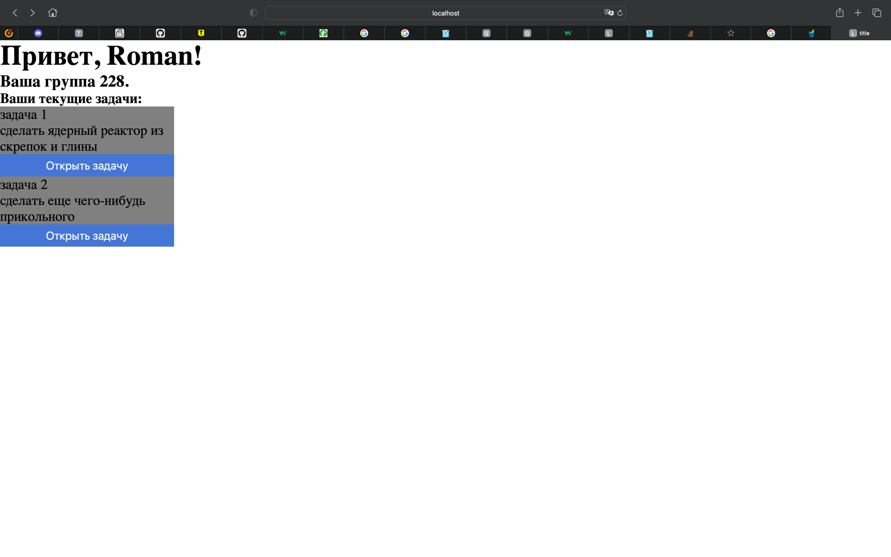
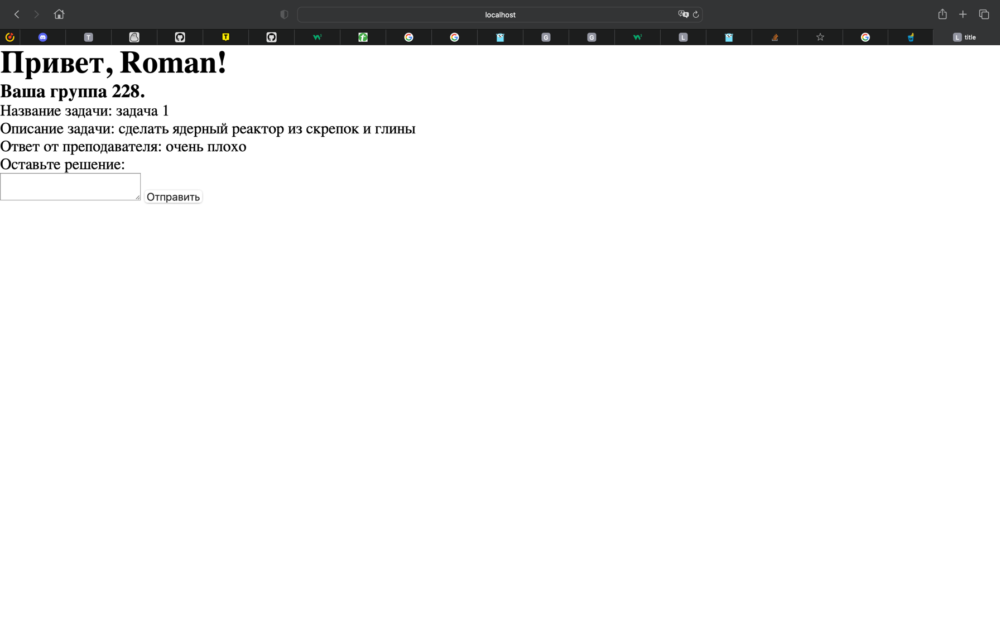
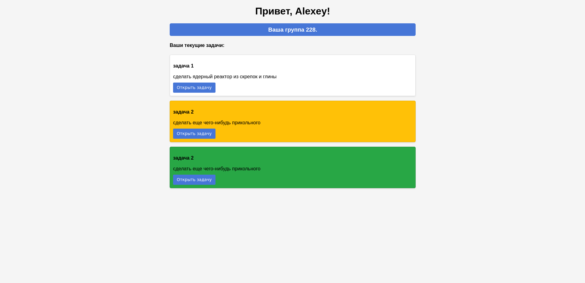
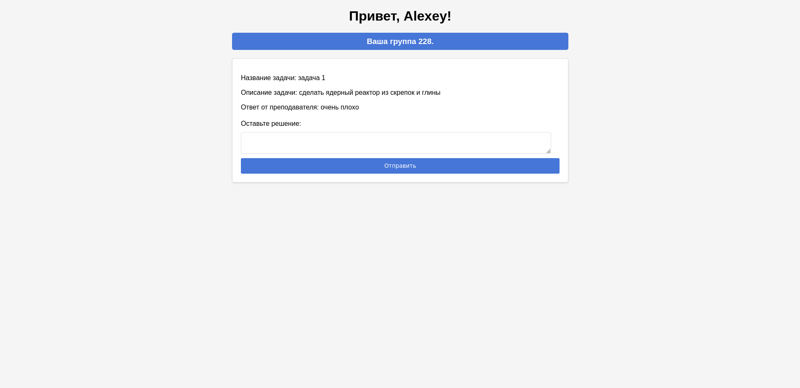

# Приложение-Web: сбор/проверка дз

- [Описание](#описание)
- [План на час (XP 1)](#план-на-час)
  - [Разработка](#разработка) 
  - [Итог XP 1](#итог-xp-1)
- [План на час (XP 2)](#план-на-час-xp-2)
  - [Новая функциональность](#новая-функциональность)
  - [Рефакторинг](#рефакторинг)
  - [Итог XP 2](#итог-xp-2)

### Описание

Интерфейс для сдачи домашних работ студентами преподавателям.

- Пользователи с ролями "студент", "преподаватель" проходят аутентификацию в сервисе.
- В зависимости от роли получают:
  - Список задач, у которых есть название, описание, статус, оценку (студенты)
  - Список задач, ожидающих оценивания (преподаватели)
- При нажатии на карточку открывается страница, где можно отправить файл с решением/оценить решение
- При подтверждении выставляется оценка/отправляется задание
- У пользователей меняется статус у карточки
- У преподавателей есть возможность добавлять задание на отдельной странице

Главным конкурентом являются месседжеры, например, телеграм. Мы хотим свою инфраструктуру, где будем сами управлять данными.

### План на час (XP 1)

#### Разработка

- Составить реляционную модель для всех сущностей
- Логика взаимодействия с моделями на уровне бекенда
- Реализация всех endpoint'ов
- Реализация backend-driven-ui для большего перформанса
- Подготовка wireframe'ов будущего интерфейса сервиса
- Связь фротенд и бекенд части сервиса
- Добавление CSS в интерфейс
- Деплой Postgres в VM на Yandex Cloud
- Написать Dockerfile и Docker Compose
- Заполнить Readme

#### Итог XP 1
Страница студента

Страница задачи

### План на час (XP 2)

#### Новая функциональность
- Добавить возможность ставить оценку за задание
- Добавить отображение статуса задачи в виде цвета на главном экране:
  - не сделано;
  - на проверке;
  - оценка выставлена.

#### Рефакторинг
- Написать юнит тесты
- Написать интеграционные тесты
- Написать скрипты для синтетических данных SQL
- Исправить путь до HTML-темплейтов
- Добавить CSS кода, улучшить адаптивность верстки
- Добавить endpoint для отправки оценки на задачу
- Добавить отображение статуса на карточке главной страницы

#### Итог XP 2

Страница студента

Страница задачи
